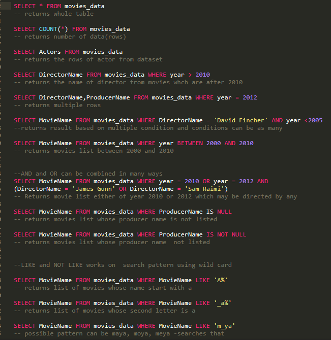
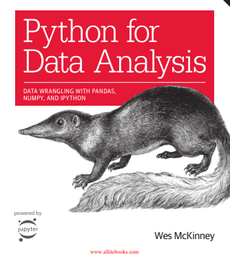

# 66DaysOfData
## The #66Days of Data is a initiative started by <a href = "https://github.com/PlayingNumbers">Ken Jee</a> started to help people develop better data science habits! 

#### In this repo, I will push all the things I have learned in that day
## Current Learning Resources:
<ul>
  <li>
    <a href = "https://www.coursera.org/specializations/google-data-analytics">Google Data Analytics Course</a>
  </li>
   <li>
    <a href = "https://www.amazon.com/Python-Data-Analysis-Wrangling-IPython/dp/1491957662/ref=sr_1_3?dchild=1&keywords=Data+Analysis&qid=1602718388&sr=8-3">Book: Data Analysis With Python</a>
  </li>
   <li>
    <a href = "https://learn.datacamp.com/practice">Daily Practise on Datacamp</a>
  </li>
   <li>
    <a href = "https://www.kaggle.com/datasets">DataSet For Analysis</a>
  </li>
  
  ## Daily Updates
  ### Day1
  
   
  ### Day2
  
   
  ### Day3
  ### Day4
  ### Day5
  ### Day6
  
  
  
