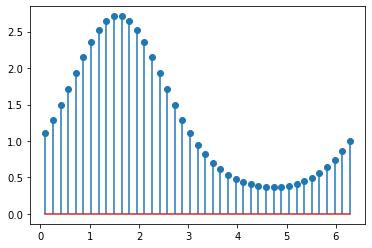
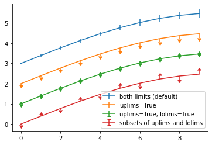
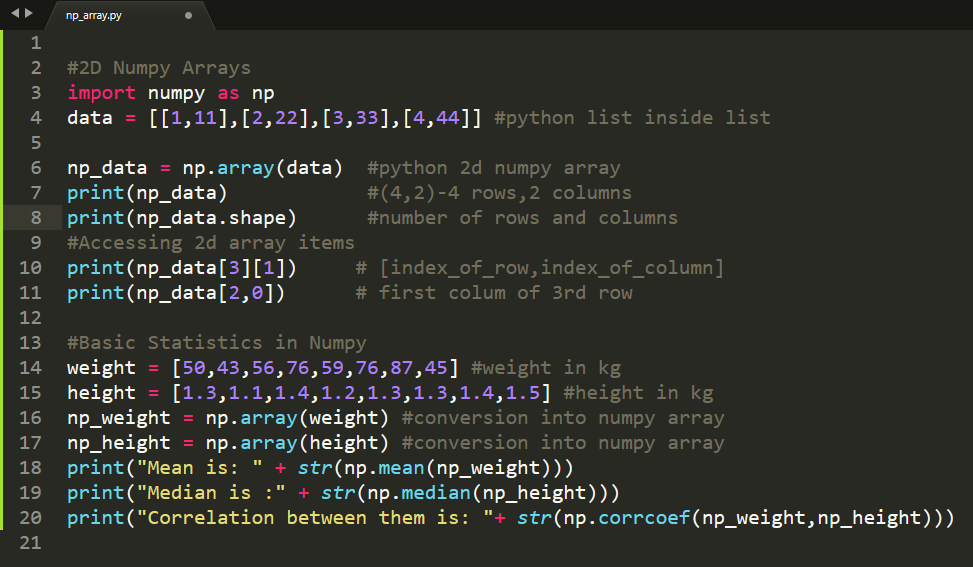
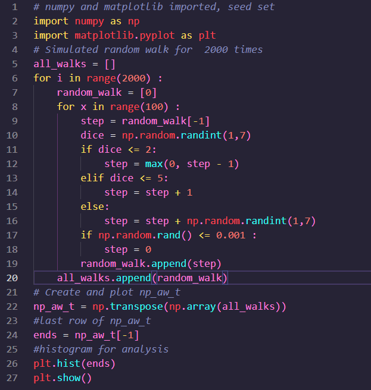
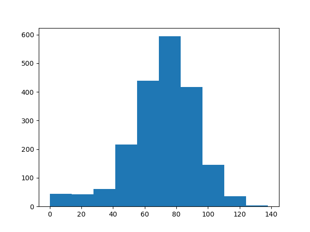
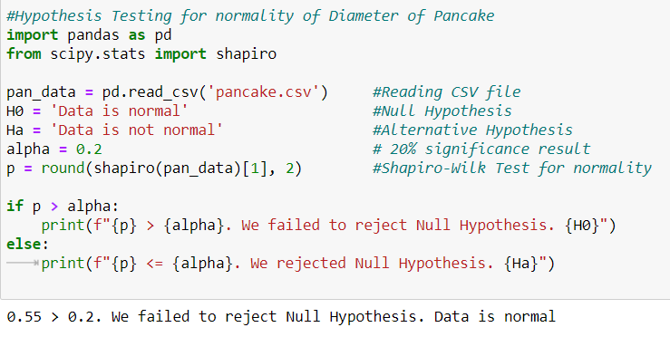

# 66DaysOfData
## The #66Days of Data is a initiative started by <a href = "https://github.com/PlayingNumbers">Ken Jee</a> started to help people develop better data science habits! 

#### In this repo, I will push all the things I have learned in that day
## Current Learning Resources:
<ul>
  <li>
    <a href = "https://www.coursera.org/specializations/google-data-analytics">Google Data Analytics Course</a>
  </li>
   <li>
    <a href = "https://www.amazon.com/Python-Data-Analysis-Wrangling-IPython/dp/1491957662/ref=sr_1_3?dchild=1&keywords=Data+Analysis&qid=1602718388&sr=8-3">Book: Data Analysis With Python</a>
  </li>
   <li>
    <a href = "https://learn.datacamp.com/practice">Daily Practise on Datacamp</a>
  </li>
   <li>
    <a href = "https://www.kaggle.com/datasets">DataSet For Analysis</a>
  </li>
  
  ## Daily Updates
  ### <b>Day1 of 66DaysOfData</b> 
  
I did few chapters of the SQL Course from @DataCamp
and learn several methods for data cleaning. SQL queries like SELECT, AND, OR, IS NOT NULL, LIKE helps to filter out outliers and make data suitable for further analysis.

     
  
  ### <b>Day2 of 66DaysOfData</b> 
  
Python for Data Analysis by Wes McKinney is an amazing book to start Data Science Learning. Just on the first day of studying, I knew many things about libraries like pandas and numpy which are powerful DS Libraries. This book is going to help a lot.

     
  
  ### <b>Day3 of 66DaysOfData</b> 
  
Visualization is a crucial part of Data Analysis as visualization gives a clear idea of what the information means by giving it visual context through maps or graphs. Noise from data is removed if we are able to visualize data beautifully. And Python has got matplotlib for it. Matplotlib is a comprehensive library for creating static, animated, and interactive visualizations in Python.

     
     
  
  ### <b>Day4 of 66DaysOfData</b> 
  
Today I learned about Numpy 2D arrays and Basic Statistics in Numpy. As Numpy Stands for Numerical Python it adds support for large, multi-dimensional arrays and matrices, along with a large collection of high-level mathematical functions. Numpy is equipped with many statistical functions as they are the key for analysis in case of a large chunk of data. They work with arrays.

     
  
  ### <b>Day5 of 66DaysOfData</b> 
     
     
  
  ### <b>Day6 of 66DaysOfData</b> 
     
  
  
  
